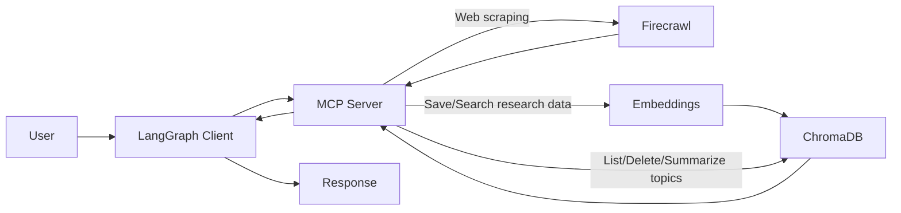
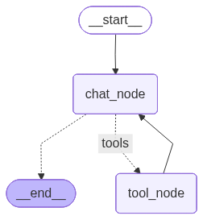
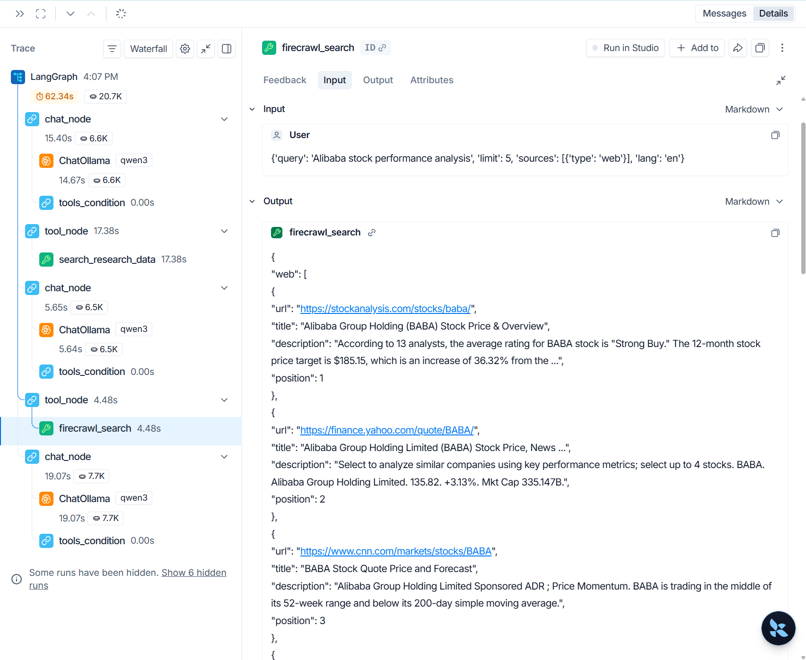
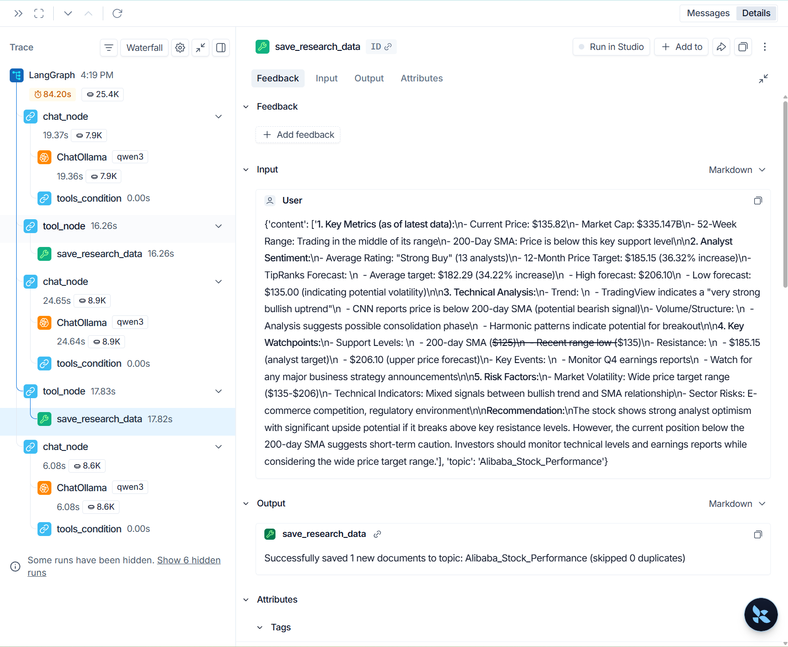
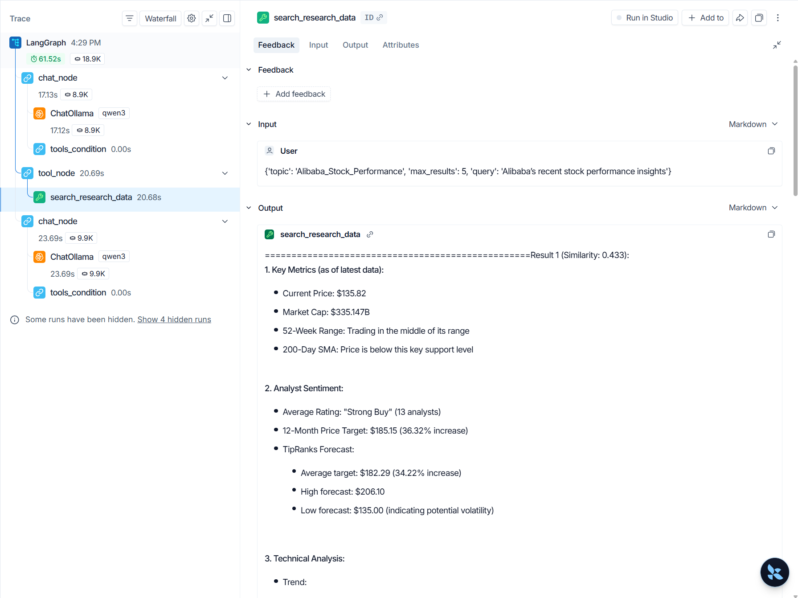
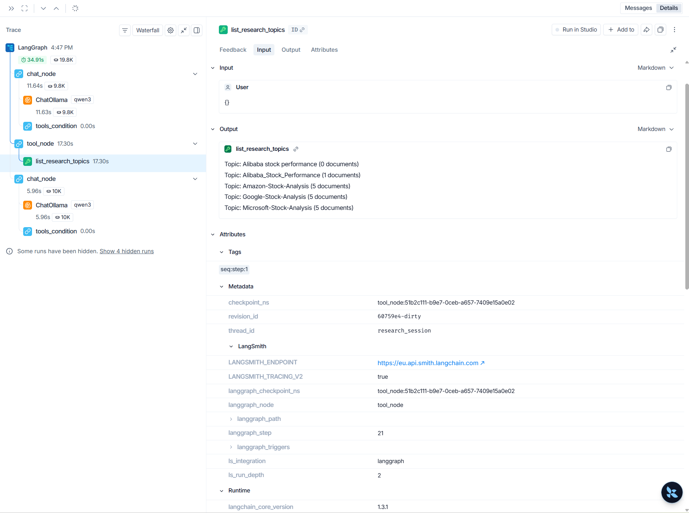
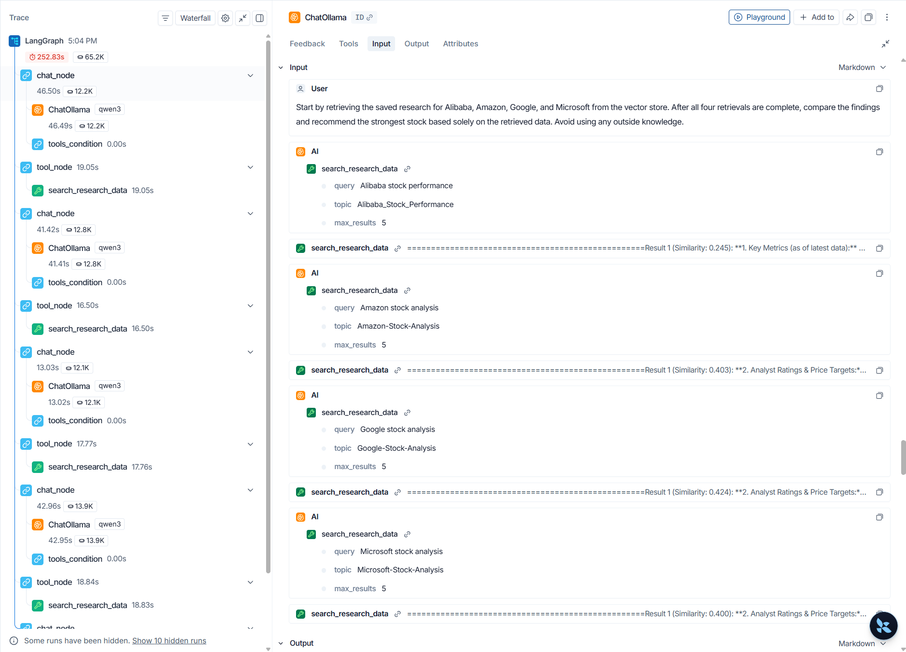
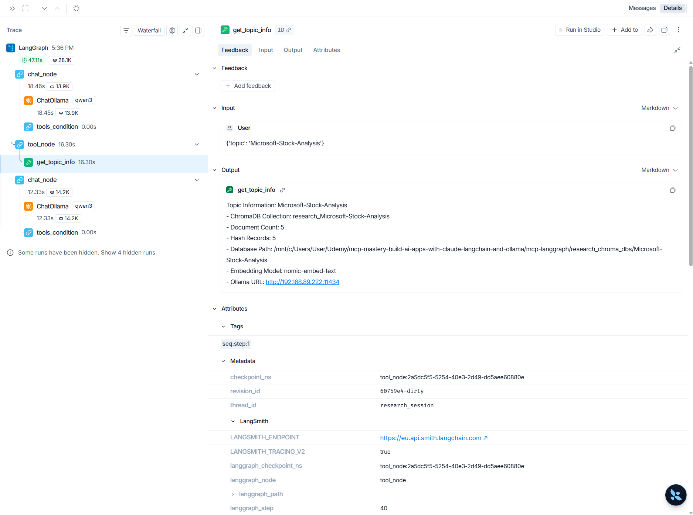
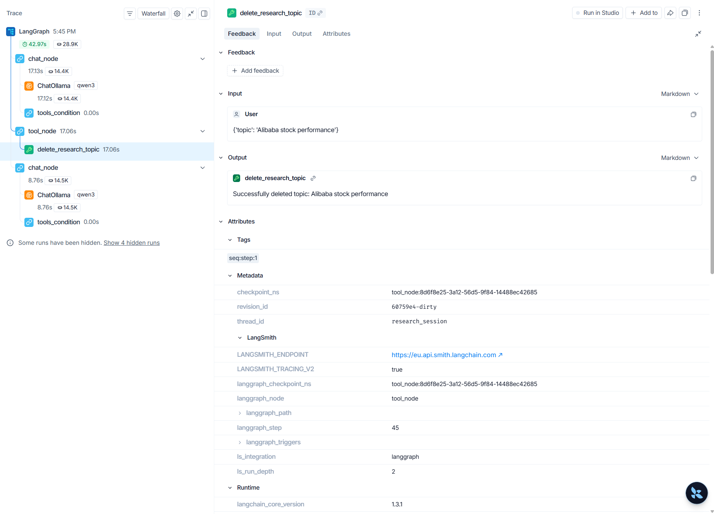
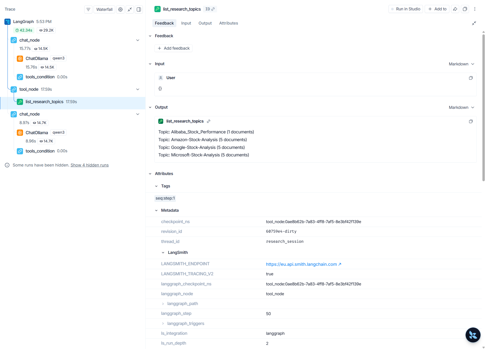

## 🤖🎓 MCP + LangGraph & LangChain RAG — Research Assistant Agent

<div align="center">

**An agentic research pipeline powered by MCP tools, LangGraph orchestration,**<br>
**LangChain RAG, Firecrawl web crawling, and local LLM reasoning**

[](https://www.python.org/)
[](https://gofastmcp.com/)
[](https://www.langchain.com/langgraph)
[](https://langchain.com/)
[](https://www.firecrawl.dev/)
[](https://www.trychroma.com/)
[](https://ollama.com/)
[](https://smith.langchain.com/)

</div>

## 📚 Table of Contents
<details>
  <summary><strong>Expand to view contents</strong></summary>
<br>

- [📌 Project Overview](#-project-overview)
- [🛠️ Tech Stack](#️-tech-stack)
- [📁 Repository Structure](#-repository-structure)
- [🏗️ Architecture](#️-architecture)
- [🔧 MCP Sever](#-mcp-sever)
- [🧠 LangGraph Agent Client](#-langgraph-agent-client)
- [📊 LangSmith Observability](#-langsmith-observability)
- [⚙️ Setup Instructions](#️-setup-instructions)
- [🚀 How to Run](#-how-to-run)
- [🧪 Example Workflow](#-example-workflow)
- [🔮 Future Work](#-future-work)

</details>

---

## 📌 Project Overview
This project implements a fully orchestrated **Research Assistant** powered by **MCP tools**, a **LangGraph agent**, and **LangChain‑based semantic retrieval**, running entirely on **local LLM inference (Ollama)**.  
It demonstrates a modern agentic workflow pattern combining **tool‑aware reasoning**, **multi‑step orchestration**, and **private RAG capabilities**.

### Features

- **MCP Tooling Layer**  
  - Save research data into Chroma  
  - Semantic search across stored topics  
  - List available topics  
  - Delete entire research topics  
  - Summarize detailed topic information  
  - Firecrawl integration for web crawling  

- **LangGraph Agent**  
  - Multi‑step orchestration of MCP tools  
  - Structured agent state  
  - Deterministic workflow execution  

- **RAG Element (Retrieval)**  
  - Chroma vectorstore  
  - Deduplication logic  
  - Semantic similarity search  

- **Local LLM Inference (Ollama)**  
  - No token billing or API quotas  
  - Runs fully offline with no external dependencies  
  - Keeps all data and embeddings on‑device for maximum privacy  
  - Provides fast, low‑latency inference on local hardware  

- **LangSmith Observability**  
  - Tracing agent steps, tool calls, and chat I/O  
  - Useful for debugging and inspection  

---

## 🛠️ Tech Stack

| Component | Technology | Purpose |
| --- | --- | --- |
| 🐍 **Programming** | Python | Version 3.13 — AI backend |
| 🔧 **MCP Server** | FastMCP | Tool discovery & invocation |
| 🧠 **Agent Orchestration** | LangGraph | Multi‑step agent workflow |
| 🔗 **Framework Integration** | LangChain | RAG pipeline utilities |
| 🌐 **Web Crawling** | Firecrawl | Automated web scraping |
| 🧬 **Embeddings** | Ollama — `nomic-embed-text` | Generate semantic vectors |
| 🧊 **Vector Database** | Chroma | Store & query embeddings |
| 🤖 **Chat Model** | Ollama — `qwen3` | Local LLM reasoning |
| 📊 **Observability** | LangSmith | Tracing & debugging |

---

## 📁 Repository Structure

```
notebooks/                       # Jupyter notebooks for demos & experiments
├── client.ipynb                 # Notebook showcasing LangGraph client usage
├── graph.png                    # Graph diagram for agent workflow visualization
└── server.ipynb                 # Notebook showcasing MCP server usage
presentation/                    # Slides or HTML presentation
└── research_assistant.html      # Presentation for Research Assistant agent
research_chroma_dbs/             # Prebuilt Chroma DBs for RAG retrieval
├── Amazon-Stock-Analysis/       # Amazon stock research data
├── Google-Stock-Analysis/       # Google stock research data
└── Microsoft-Stock-Analysis/    # Microsoft stock research data
.env.example                     # Example environment variables template
.gitignore                       # Git ignore rules
README.md                        # Project documentation
client.py                        # MCP client implementation
mcp.json                         # MCP configuration file
requirements.txt                 # Project dependencies
server.py                        # MCP server implementation
client_test.py                   # Lightweight client for testing
```

---

## 🏗️ Architecture

### **Data Flow**
**User Query → LangGraph Client → MCP Server → Tools (Firecrawl / Embeddings + Chroma) → LangGraph Client → Response**

### **System Diagram**


---

## 🔧 MCP Sever

- **Topic‑based research storage** — save, organize, and manage research data in Chroma  
- **Semantic retrieval** — search and summarize stored topics using vector similarity  
- **Topic management** — list, inspect, and delete research topics  
- **Web data ingestion** — integrate Firecrawl for crawling, scraping, and structured extraction  

### Available Tools

#### **Core Research Tools**  
(Custom tools used directly in the RAG workflow)

- **save_research_data**  
  Stores cleaned, deduplicated text chunks into Chroma under a topic.

- **search_research_data**  
  Performs semantic similarity search and returns top‑k results.

- **list_research_topics**  
  Lists all available research topics.

- **delete_research_topic**  
  Deletes an entire topic directory and its vectorstore.

- **get_topic_info**  
  Returns metadata and statistics for a given research topic.

#### **Firecrawl — Web Scraping & Browser Automation Tools**  
(Provided by the Firecrawl MCP server)

- **firecrawl_search**  
  Searches the web and returns structured results.

- **firecrawl_scrape**  
  Scrapes a single URL and extracts cleaned content.

- **firecrawl_map**  
  Maps and extracts multiple URLs in batch.

- **firecrawl_crawl**  
  Starts a full‑site crawl job.

- **firecrawl_check_crawl_status**  
  Checks the status of a running crawl job.

- **firecrawl_extract**  
  Extracts structured data from a webpage.

- **firecrawl_agent**  
  Runs Firecrawl’s autonomous crawling agent.

- **firecrawl_agent_status**  
  Checks the status of an agent‑based crawl.

- **firecrawl_browser_create**  
  Creates a headless browser session.

- **firecrawl_browser_execute**  
  Executes browser actions (navigate, click, extract, etc.).

- **firecrawl_browser_delete**  
  Deletes a browser session.

- **firecrawl_browser_list**  
  Lists active browser sessions.

---

## 🧠 LangGraph Agent Client

- **Workflow definition** — defines the agent graph, node functions, and control flow  
- **MCP integration** — routes tool calls through the MCP client for execution  
- **Multi‑step pipelines** — runs research → save → retrieve sequences through iterative LLM–tool loops  
- **Deterministic orchestration** — executes rule‑based transitions between chat and tool nodes 

### Graph Workflow
```
START → chat_node
chat_node → tool_node (if tool call)
chat_node → END (if no tool call)
tool_node → chat_node
```

<div align="center">
  
  <p><em>Agent Workflow — Graph Diagram</em></p>
</div>

---

## 📊 LangSmith Observability

- **End‑to‑end tracing** — capture full agent execution across nodes and tool calls  
- **Tool‑level inspection** — examine MCP tool inputs, outputs, and vectorstore retrievals  
- **Workflow validation** — debug agent behavior and verify orchestration correctness  

---

## ⚙️ Setup Instructions

1. **Clone the repository**  
   ```bash
   git clone https://github.com/kpma1120/mcp-portfolio.git
   cd mcp-portfolio
   ```

2. **Create the virtual environment**  
   - Create a virtual environment with Python 3.13.*
   - Install python dependencies:
   
     ```bash
     pip install requirements.txt
     ```

3. **Configure environment variables**  
   - Copy `.env.example` → `.env`  
   - Fill in your API keys:
     - FIRECRAWL_API_KEY=your-firecrawl-api-key
     - LANGSMITH_API_KEY=your-langsmith-api-key
   - Set `OLLAMA_BASE_URL` according to your environment (e.g. http://localhost:11434).

---

## 🚀 How to Run

### **Run via Python scripts**

1. Start the MCP server

   Launch the MCP server using the provided `server.py`:

   ```bash
   python server.py
   ```

   This process:

   - Exposes all MCP tools  
   - Serves as the tool layer consumed by the LangGraph client  

2. Start the LangGraph Research Assistant client

   Run the main entry point for the LangGraph + Ollama client:

   ```bash
   python client.py
   ```

   This will:

   - Connect to the MCP server  
   - Initialize the LangGraph agent workflow  
   - Execute the full pipeline of **research → storage → retrieval**

   If you run into errors with `client.py`, you can start with `client_test.py` as a fallback. It’s a simplified client containing only the `get_tools()` call, making it easier to verify that the MCP connection works.

### **Run via Jupyter notebooks**

1. Start the MCP server

   You still need to run:

   ```bash
   python server.py
   ```

   However, `server.ipynb` provides a step‑by‑step breakdown of the server’s internal structure, allowing you to explore and understand how `server.py` works under the hood.

2. Start the LangGraph Research Assistant client

   Open and run `client.ipynb` to interact with the agent step‑by‑step inside a notebook environment.  
   This lets you inspect the workflow, messages, and tool calls interactively.

---

## 🧪 Example Workflow

<details>
  <summary><strong>Click to expand example workflow</strong></summary>

```bash
🔬 Research Assistant with Firecrawl & RAG
==================================================
[04/26/26 16:04:07] INFO     Processing request of type ListToolsRequest                                                                                        server.py:727

📚 Available Tools:
  • save_research_data
  • search_research_data
  • list_research_topics
  • delete_research_topic
  • get_topic_info
  • firecrawl_scrape
  • firecrawl_map
  • firecrawl_search
  • firecrawl_crawl
  • firecrawl_check_crawl_status
  • firecrawl_extract
  • firecrawl_agent
  • firecrawl_agent_status
  • firecrawl_browser_create
  • firecrawl_browser_execute
  • firecrawl_browser_delete
  • firecrawl_browser_list

💡 Example commands:
  • 'Research the latest developments in AI agents'
  • 'Save this research to topic: ai_agents'
  • 'Search my previous research on machine learning'
  • 'What topics have I researched?'
  • 'Scrape https://example.com and save key insights'

==================================================
Type 'quit' or 'exit' to end the session
```

---

```bash
🤔 You: Conduct a research analysis on Alibaba’s stock performance.
```

```bash
🤖 Assistant (Please wait...): [04/26/26 16:08:04] INFO     Processing request of type CallToolRequest                                                                                         server.py:727
                    INFO     Processing request of type ListToolsRequest                                                                                        server.py:727
Here's a structured analysis of Alibaba's (BABA) stock performance based on recent data:

**1. Key Metrics (as of latest data):**
- **Current Price:** $135.82
- **Market Cap:** $335.147B
- **52-Week Range:** Trading in the middle of its range
- **200-Day SMA:** Price is below this key support level

**2. Analyst Sentiment:**
- **Average Rating:** "Strong Buy" (13 analysts)
- **12-Month Price Target:** $185.15 (36.32% increase)
- **TipRanks Forecast:** 
  - Average target: $182.29 (34.22% increase)
  - High forecast: $206.10
  - Low forecast: $135.00 (indicating potential volatility)

**3. Technical Analysis:**
- **Trend:** 
  - TradingView indicates a "very strong bullish uptrend"
  - CNN reports price is below 200-day SMA (potential bearish signal)
- **Volume/Structure:** 
  - Analysis suggests possible consolidation phase
  - Harmonic patterns indicate potential for breakout

**4. Key Watchpoints:**
- **Support Levels:** 
  - 200-day SMA (~$125)
  - Recent range low (~$135)
- **Resistance:** 
  - $185.15 (analyst target)
  - $206.10 (upper price forecast)
- **Key Events:** 
  - Monitor Q4 earnings reports
  - Watch for any major business strategy announcements

**5. Risk Factors:**
- **Market Volatility:** Wide price target range ($135-$206)
- **Technical Indicators:** Mixed signals between bullish trend and SMA relationship
- **Sector Risks:** E-commerce competition, regulatory environment

**Recommendation:** 
The stock shows strong analyst optimism with significant upside potential if it breaks above key resistance levels. However, the current position below the 200-day SMA suggests short-term caution. Investors should monitor technical levels and earnings reports while considering the wide price target range.

Would you like me to perform any specific analysis (e.g., comparative analysis with other e-commerce stocks, valuation metrics, or risk assessment models)?
```

<div align="center">
  
  <p><em>LangSmith Tracing 1</em></p>
</div>

---

```bash
🤔 You: Save the research output to the vector store.
```

```bash
🤖 Assistant (Please wait...): [04/26/26 16:19:46] INFO     Processing request of type CallToolRequest                                                                                         server.py:727
[04/26/26 16:19:47] INFO     Processing request of type ListToolsRequest                                                                                        server.py:727
[04/26/26 16:20:28] INFO     Processing request of type CallToolRequest                                                                                         server.py:727
[04/26/26 16:20:29] INFO     HTTP Request: POST http://192.168.89.222:11434/api/embed "HTTP/1.1 200 OK"                                                       _client.py:1025
                    INFO     Processing request of type ListToolsRequest                                                                                        server.py:727
The research analysis on Alibaba's stock performance has been successfully saved to the vector database under the topic **"Alibaba_Stock_Performance"**. 

Would you like to perform any additional analysis or save further research findings?
```

<div align="center">
  
  <p><em>LangSmith Tracing 2</em></p>
</div>

---

```bash
🤔 You: What insights were found about Alibaba’s recent stock performance in the stored research data?
```

```bash
🤖 Assistant (Please wait...): [04/26/26 16:30:24] INFO     Processing request of type CallToolRequest                                                                                         server.py:727
[04/26/26 16:30:27] INFO     HTTP Request: POST http://192.168.89.222:11434/api/embed "HTTP/1.1 200 OK"                                                       _client.py:1025
                    INFO     Processing request of type ListToolsRequest                                                                                        server.py:727
Here are the key insights from the stored research data on Alibaba's (BABA) recent stock performance:

---

### **1. Key Metrics**
- **Current Price:** $135.82  
- **Market Cap:** $335.147B  
- **52-Week Range:** Trading near the middle of its historical range  
- **200-Day SMA:** Price is below this key support level, indicating potential short-term bearishness  

---

### **2. Analyst Sentiment**
- **Average Rating:** "Strong Buy" (13 analysts)  
- **12-Month Price Target:** $185.15 (36.32% increase from current price)  
- **TipRanks Forecast:**  
  - **Average Target:** $182.29 (34.22% increase)  
  - **High Forecast:** $206.10  
  - **Low Forecast:** $135.00 (suggesting volatility)  

---

### **3. Technical Analysis**
- **Trend:**  
  - **Bullish Uptrend:** TradingView indicates a "very strong bullish uptrend."  
  - **SMA Relationship:** Price is below the 200-day SMA, which may signal short-term weakness.  
- **Volume/Structure:**  
  - Possible consolidation phase observed.  
  - Harmonic patterns suggest potential for a breakout.  

---

### **4. Key Watchpoints**
- **Support Levels:**  
  - 200-day SMA (~$125)  
  - Recent range low (~$135)  
- **Resistance Levels:**  
  - $185.15 (analyst target)  
  - $206.10 (upper price forecast)  
- **Key Events:**  
  - Monitor **Q4 earnings reports** for guidance.  
  - Watch for **major business strategy announcements** (e.g., new markets, regulatory changes).  

---

### **5. Risk Factors**
- **Market Volatility:** Wide price target range ($135–$206) suggests potential for sharp swings.  
- **Technical Indicators:** Mixed signals between bullish momentum and SMA-related caution.  
- **Sector Risks:**  
  - Intense competition in e-commerce.  
  - Regulatory uncertainties in China and globally.  

---

### **Recommendation**
- **Upside Potential:** Strong analyst optimism and bullish technical patterns suggest significant upside if the stock breaks above key resistance levels ($185–$206).  
- **Short-Term Caution:** The price being below the 200-day SMA indicates short-term caution; investors should monitor this level.  
- **Actionable Steps:**  
  - Track earnings reports and strategic announcements.  
  - Use technical levels ($125–$135 support, $185–$206 resistance) as entry/exit points.  
  - Consider volatility risks and diversify holdings.  

Would you like to refine this analysis further or compare it with other stocks in the sector?
```

<div align="center">
  
  <p><em>LangSmith Tracing 3</em></p>
</div>

---

```bash
🤔 You: What research topics have already been saved?
```

```bash
🤖 Assistant (Please wait...): [04/26/26 16:47:46] INFO     Processing request of type CallToolRequest                                                                                         server.py:727
[04/26/26 16:47:47] INFO     Processing request of type ListToolsRequest                                                                                        server.py:727
Here are the research topics currently saved in the vector database:

1. **Alibaba stock performance** (0 documents)  
2. **Alibaba_Stock_Performance** (1 document)  
3. **Amazon-Stock-Analysis** (5 documents)  
4. **Google-Stock-Analysis** (5 documents)  
5. **Microsoft-Stock-Analysis** (5 documents)  

Would you like to explore details about any of these topics or perform additional research on another stock?
```

<div align="center">
  
  <p><em>LangSmith Tracing 4</em></p>
</div>

---

```bash
🤔 You: Start by retrieving the saved research for Alibaba, Amazon, Google, and Microsoft from the vector store. After all four retrievals are complete, compare the findings and recommend the strongest stock based solely on the retrieved data. Avoid using any outside knowledge.
```

```bash
🤖 Assistant (Please wait...): [04/26/26 17:05:10] INFO     Processing request of type CallToolRequest                                                                                         server.py:727
[04/26/26 17:05:12] INFO     HTTP Request: POST http://192.168.89.222:11434/api/embed "HTTP/1.1 200 OK"                                                       _client.py:1025
                    INFO     Processing request of type ListToolsRequest                                                                                        server.py:727
[04/26/26 17:06:09] INFO     Processing request of type CallToolRequest                                                                                         server.py:727
[04/26/26 17:06:10] INFO     HTTP Request: POST http://192.168.89.222:11434/api/embed "HTTP/1.1 200 OK"                                                       _client.py:1025
                    INFO     Processing request of type ListToolsRequest                                                                                        server.py:727
[04/26/26 17:06:40] INFO     Processing request of type CallToolRequest                                                                                         server.py:727
                    INFO     HTTP Request: POST http://192.168.89.222:11434/api/embed "HTTP/1.1 200 OK"                                                       _client.py:1025
                    INFO     Processing request of type ListToolsRequest                                                                                        server.py:727
[04/26/26 17:07:42] INFO     Processing request of type CallToolRequest                                                                                         server.py:727
                    INFO     HTTP Request: POST http://192.168.89.222:11434/api/embed "HTTP/1.1 200 OK"                                                       _client.py:1025
                    INFO     Processing request of type ListToolsRequest                                                                                        server.py:727
### **Comparison of Stored Research Data**  
Based strictly on the retrieved data, here's a structured comparison of Alibaba, Amazon, Google, and Microsoft:

---

### **1. Alibaba (BABA)**  
- **Analyst Sentiment:**  
  - **Rating:** "Strong Buy" (13 analysts)  
  - **12-Month Target:** $185.15 (36.32% increase)  
- **Technical Indicators:**  
  - Strong bullish trend (TradingView) but price is below 200-day SMA (potential short-term weakness).  
  - Volatility: Wide range ($135–$206).  
- **Key Risks:**  
  - E-commerce competition, regulatory environment, and mixed technical signals.  

---

### **2. Amazon (AMZN)**  
- **Analyst Sentiment:**  
  - **Rating:** "Strong Buy" (43 analysts)  
  - **12-Month Target:** $281.95 (13.56% increase)  
- **Technical Indicators:**  
  - Recent 24h decline (0.91%), but strong financial results from AI investments and AWS growth.  
  - Volatility: Moderate ($245–$256 range).  
- **Key Risks:**  
  - Tech sector macro trends, AI disruption fears.  

---

### **3. Google (GOOGL/GOOG)**  
- **Analyst Sentiment:**  
  - **Rating:** "Strong Buy" (44 analysts)  
  - **12-Month Target:** $355.48 (5.35% increase)  
- **Technical Indicators:**  
  - 52-week range: $146.10–$349.00 (wide volatility).  
  - Recent 24h decline for GOOG but strong historical growth.  
- **Key Risks:**  
  - Tech sector trends, product launches, and macroeconomic factors.  

---

### **4. Microsoft (MSFT)**  
- **Analyst Sentiment:**  
  - **Rating:** "Strong Buy" (35 analysts)  
  - **12-Month Target:** $584.24 (39.75% increase)  
- **Technical Indicators:**  
  - Recent weekly/monthly gains (12.62% weekly, 8.78% monthly).  
  - Annual decline of 10% due to AI disruption fears but strategic Copilot enhancements.  
- **Key Risks:**  
  - AI competition, enterprise spending trends.  

---

### **Recommendation Based on Stored Data**  
**Strongest Stock: Microsoft (MSFT)**  
- **Rationale:**  
  1. **Highest Upside Potential:** The 12-month target ($584.24) is significantly higher than Alibaba ($185.15), Amazon ($281.95), and Google ($355.48).  
  2. **Recent Performance:** Weekly and monthly price gains (12.62% and 8.78%) suggest resilience despite a 10% annual decline.  
  3. **Strategic Positioning:** Focus on Copilot and cloud growth aligns with long-term tech trends.  
  4. **Analyst Consensus:** "Strong Buy" from 35 analysts, indicating strong institutional confidence.  

**Why Not Alibaba?**  
- While Alibaba has a high target ($185.15), its current price is below the 200-day SMA, signaling short-term caution.  

**Why Not Amazon/Google?**  
- Their targets are lower, and their volatility ranges are narrower compared to Microsoft.  

**Final Note:**  
Microsoft appears most promising based on the stored data, combining strong analyst optimism, higher upside potential, and recent price resilience. However, all four stocks show "Strong Buy" ratings, so the choice depends on risk tolerance and investment horizon.
```

<div align="center">
  
  <p><em>LangSmith Tracing 5</em></p>
</div>

---

```bash
🤔 You: Show me the stored topic information for Microsoft.
```

```bash
🤖 Assistant (Please wait...): [04/26/26 17:37:03] INFO     Processing request of type CallToolRequest                                                                                         server.py:727
[04/26/26 17:37:04] INFO     Processing request of type ListToolsRequest                                                                                        server.py:727
Here is the stored topic information for **Microsoft-Stock-Analysis**:

---

### **Topic Details**
- **Topic Name:** `Microsoft-Stock-Analysis`  
- **ChromaDB Collection:** `research_Microsoft-Stock-Analysis`  
- **Document Count:** 5  
- **Hash Records:** 5  
- **Database Path:**  
  `/mnt/c/Users/User/Udemy/mcp-mastery-build-ai-apps-with-claude-langchain-and-ollama/mcp-langgraph/research_chroma_dbs/Microsoft-Stock-Analysis`  
- **Embedding Model Used:** `nomic-embed-text`  
- **Ollama URL:** `http://192.168.89.222:11434`  

---

### **Key Findings from Stored Data**
1. **Analyst Sentiment:**  
   - **Rating:** "Strong Buy" (35 analysts)  
   - **12-Month Target:** $584.24 (39.75% increase from current price)  

2. **Technical Indicators:**  
   - Recent **weekly/monthly gains** (12.62% weekly, 8.78% monthly).  
   - Annual decline of 10% due to AI disruption fears, but strategic Copilot enhancements are underway.  

3. **Market Position:**  
   - Focus on **cloud computing** and **AI innovation** (Copilot).  
   - Strong institutional confidence with "Strong Buy" ratings.  

4. **Risks:**  
   - AI competition and enterprise spending trends.  

---

### **Why This Topic Was Created**  
The topic was saved to organize and analyze Microsoft's stock performance, including analyst ratings, price targets, technical indicators, and macroeconomic factors influencing its valuation.  

Would you like to retrieve specific documents from this topic or compare it with another stock?
```

<div align="center">
  
  <p><em>LangSmith Tracing 6</em></p>
</div>

---

```bash
🤔 You: Delete the research topic named exactly “Alibaba stock performance”. Do not delete any other topic, including “Alibaba_Stock_Performance”. Only remove the topic whose name matches exactly.
```

```bash
🤖 Assistant (Please wait...): [04/26/26 17:46:07] INFO     Processing request of type CallToolRequest                                                                                         server.py:727
[04/26/26 17:46:08] INFO     Processing request of type ListToolsRequest                                                                                        server.py:727
The research topic **"Alibaba stock performance"** has been successfully deleted. 

✅ **Important:**  
- The topic **"Alibaba_Stock_Performance"** (with an underscore) was **not** deleted, as requested.  
- All other topics (**Amazon-Stock-Analysis**, **Google-Stock-Analysis**, **Microsoft-Stock-Analysis**) remain untouched.  

Would you like to verify the remaining topics or perform another action?
```

<div align="center">
  
  <p><em>LangSmith Tracing 7</em></p>
</div>

---

```bash
🤔 You: List all current research topics again so I can confirm that only the four valid stock topics remain.
```

```bash
🤖 Assistant (Please wait...): [04/26/26 17:53:57] INFO     Processing request of type CallToolRequest                                                                                         server.py:727
[04/26/26 17:53:58] INFO     Processing request of type ListToolsRequest                                                                                        server.py:727
Here are the current research topics in the vector store:

1. **Alibaba_Stock_Performance** (1 document)  
2. **Amazon-Stock-Analysis** (5 documents)  
3. **Google-Stock-Analysis** (5 documents)  
4. **Microsoft-Stock-Analysis** (5 documents)  

✅ **Confirmation:**  
- The topic **"Alibaba stock performance"** (with a space) has been successfully deleted.  
- The topic **"Alibaba_Stock_Performance"** (with an underscore) remains intact.  
- All other topics (**Amazon**, **Google**, **Microsoft**) are unchanged.  

Let me know if you'd like to explore any of these topics further!
```

<div align="center">
  
  <p><em>LangSmith Tracing 8</em></p>
</div>

---

```bash
🤔 You: bye
```

```bash
👋 Goodbye! Happy researching!
```
</details>

---

## 🔮 Future Work

- **Multi‑agent workflows** — introduce specialized agents (e.g. crawler, curator, summarizer) coordinated through LangGraph subgraphs  
- **Agent planning & decomposition** — add planning nodes that break complex research tasks into structured tool‑calling steps  
- **Reranking & evaluation** — insert ranking/evaluation nodes to score retrieved chunks and improve answer quality  
- **Advanced retrieval pipelines** — experiment with hybrid search, metadata filters, and topic‑aware retrieval strategies  